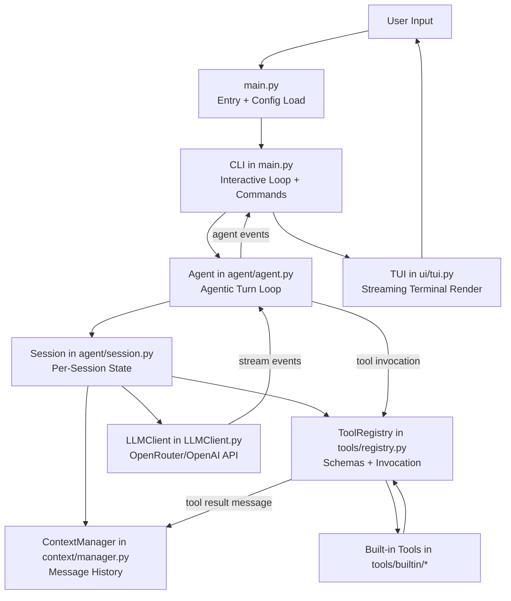
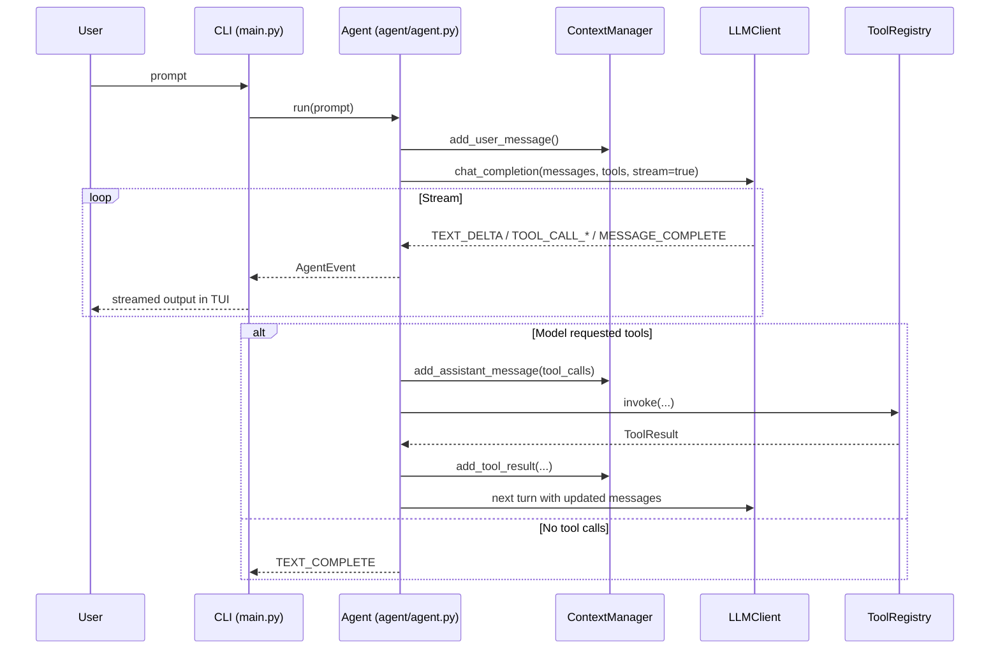

# Open Coding Agent

An interactive terminal coding agent built on the OpenRouter OpenAI-compatible API.

## Overview

This project runs a loop that:

1. accepts user prompts,
2. streams model output,
3. executes tool calls when requested by the model,
4. feeds tool results back into context,
5. continues until the turn completes.

Configuration is loaded once at startup in [main.py](main.py) and passed through the full runtime stack.

## High-Level Architecture

### Mermaid



### Plain Text (Fallback)

```text
User
   -> main.py
      -> CLI
         -> Agent
            -> Session
               -> ContextManager (messages)
               -> LLMClient (chat completion stream)
               -> ToolRegistry (schemas + tool invoke)
                      -> built-in tools
            <- tool results appended to context
         <- agent events
      -> TUI rendering
<- User sees streamed assistant/tool output
```

## Runtime Flow



## Project Structure

```text
open-coding-agent/
   main.py
   LLMClient.py
   response.py
   agent/
      agent.py
      event.py
      session.py
   config/
      config.py
      loader.py
   context/
      manager.py
   prompts/
      system.py
   tools/
      base.py
      registry.py
      builtin/
         __init__.py
         read_file.py
   ui/
      tui.py
   utils/
      path.py
      text.py
```

## Setup

1. Create and activate a virtual environment.

```bash
python3 -m venv .venv
source .venv/bin/activate
```

2. Install dependencies.

```bash
pip install -r requirements.txt
```

3. Set environment variables.

```bash
export OPENROUTER_API_KEY="your_key_here"
export OPENROUTER_BASE_URL="https://openrouter.ai/api/v1"
```

4. (Optional) Add project config.

Create [.ai-agent/config.toml](.ai-agent/config.toml) in your project root. The loader merges:

1. system config from platform config dir,
2. project config from .ai-agent/config.toml,
3. runtime cwd defaults.

## Usage

Run interactive mode:

```bash
python main.py
```

Run one-shot mode:

```bash
python main.py "summarize this repository"
```

## Interactive Commands

- /help: show available commands
- /config: show loaded runtime config summary
- /messages: show the exact serialized message payload sent to the model so far
- /exit or /quit: end the interactive session

## Configuration Model

Core settings are defined in [config/config.py](config/config.py):

- model.name
- model.temperature
- model.context_window
- cwd
- max_turns
- max_tool_output_tokens
- developer_instructions
- user_instructions
- debug

Config loading behavior is implemented in [config/loader.py](config/loader.py).

## Key Implementation Files

- Entry point and CLI orchestration: [main.py](main.py)
- Agent loop and tool-call orchestration: [agent/agent.py](agent/agent.py)
- Session state container: [agent/session.py](agent/session.py)
- Message history and serialization: [context/manager.py](context/manager.py)
- OpenRouter/OpenAI chat interface and stream parsing: [LLMClient.py](LLMClient.py)
- Tool registration and invocation: [tools/registry.py](tools/registry.py)
- Terminal rendering: [ui/tui.py](ui/tui.py)

## Troubleshooting

- No API key error:
   - Ensure OPENROUTER_API_KEY is set in your shell.
- No responses shown:
   - Use /messages to inspect the exact payload being sent.
- Repeated assistant prompts:
   - Verify loop termination behavior in [agent/agent.py](agent/agent.py).
